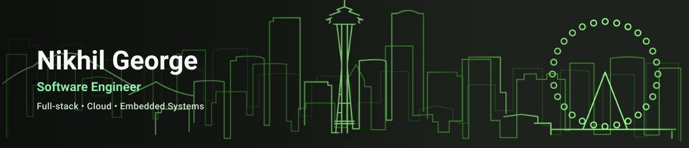

  <picture>
    <source media="(prefers-color-scheme: dark)" srcset="assets/profile-header-dark.svg">
    <source media="(prefers-color-scheme: light)" srcset="assets/profile-header-light.svg">
    
  </picture>

  
  

I'm a Computer Science student at the University of Washington building software
across full-stack systems, cloud infrastructure, and connected devices. I
currently work on insurance software at Societies Insurance and help build
Gnome, an IoT platform for indoor and outdoor plant care.

## What I'm building

- **Societies Insurance** — an ongoing Django/PostgreSQL platform for complex
  insurance intake, document mapping, and administrative workflows.
- **Gnome** — React/TypeScript product interfaces, AWS device-data services,
  MySQL data models, and ESP32-C6 firmware for connected plant sensors.

## Featured projects

<table>
<tr>
<td width="60%" valign="top">

**[Personal Smart Ring Platform](https://github.com/ngeorge15/smart-ring)**

Reverse-engineered an undocumented BLE protocol and decoded five health-data
streams from a consumer smart ring. Built a local-first ingestion and
analytics platform with Python, asyncio, SQLite, React, and TypeScript.

101 cross-checked assertions across the decode engine · Hampel filtering and
gap-aware interpolation for sensor noise.

</td>
<td width="40%" valign="top">

`Python` `asyncio` `SQLite` `React` `TypeScript`

</td>
</tr>
<tr>
<td width="60%" valign="top">

**[Prediction Market Trading Bot](https://github.com/ngeorge15/kalshi-bot)**

Sports and weather forecasting pipelines with temporal train/test/holdout
splits, walk-forward validation, and a deterministic execution path kept
separate from LLM-assisted analysis.

Calibration error below 0.05 on held-out sets · *Never run live — no trading
results are claimed.*

</td>
<td width="40%" valign="top">

`Python` `scikit-learn` `pandas` `SQLite`

</td>
</tr>
<tr>
<td width="60%" valign="top">

**[AI Calorie Counter](https://github.com/ngeorge15/ai-calorie-counter)**

Offline-first calorie tracker for iOS: barcode scan → USDA/Open Food Facts
lookup → local log → background sync, working end to end on-device. A
fine-tuned food classifier (85.78% top-1 / 95.05% top-3 on Food-101) is
trained but not yet wired into the app.

</td>
<td width="40%" valign="top">

`Expo (React Native)` `Flask` `MongoDB` `Drizzle/SQLite` `PyTorch`

</td>
</tr>
</table>

## Technical toolkit

Also: `C` · `Java` · `JavaScript` · `SQL` · `Express` · `FastAPI` · `MySQL` ·
`SQLite` · `Linux` · `POSIX` · `PlatformIO`

## Connect

[LinkedIn](https://www.linkedin.com/in/nikhil-george01) · [ngeorge1@uw.edu](mailto:ngeorge1@uw.edu)
